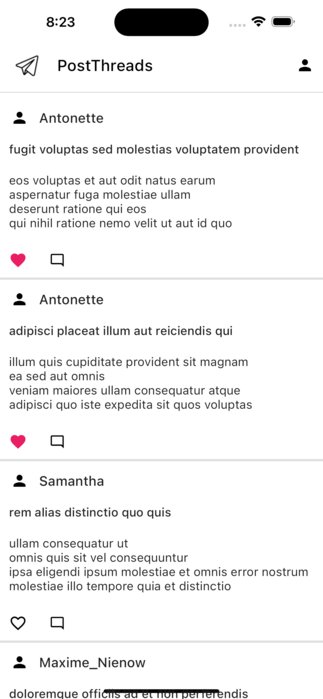
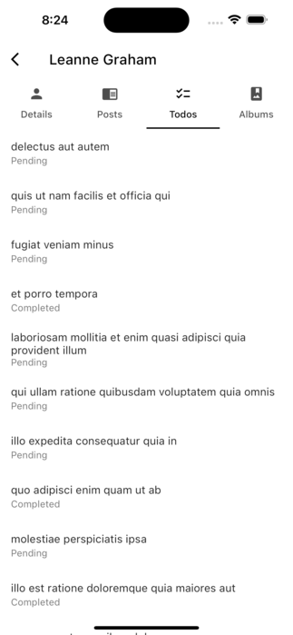

# Flutter PostThread App

Welcome to the Flutter Social App! This application allows users to view and interact with posts, user profiles, comments, and albums with photos. 

## Features

### Post Listing

- View a list of user posts with titles and excerpts.
- Scroll through the posts to discover various content.

    

### Post Detail with Comments

- Click on a post to view its full details.
- Read and interact with comments on each post.
   
     

### User Listing

- Explore a list of users within the app.
- Click on a user to access their profile information.
   
     

### User Details, Posts, Todos, and Albums

- When you click on a user's profile, you can access:
  - User details, including name, email, and phone.
  - A list of the user's posts.
  - A list of the user's to-do tasks.
  - An album containing photos associated with the user.

           

   
### User Albums with Photos

- Navigate to the user's albums to view a list of albums.
- Click on an album to see a collection of photos.
- Open photos for a larger view.

       

    

    
